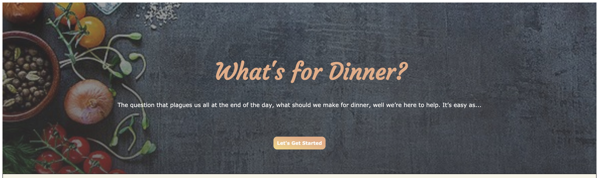

# What’s For Dinner?

## Description: 
What’s for Dinner, helps people make the best decision that busy people have to deal with every day, what should I make for dinner? The problem comes when someone has a fridge or pantry of items and wants to make something new or best utilizes what they have in inventory already. That’s why we have created an app that will take the list of ingredients and show them the 5 closest recipes that match what they have. The list will include a picture, the title and other useful information like prep time and likes. 
In addition to the recipe search we add a bit of humor, and included a food topic related joke at the end of every search.

## Usage:
The application is very simple, the user will fill in ingredients in the text box and submit them to a list.
When the user is done, they simply just click the search button.
When the user clicks on their choice, they will be taken to the site of the recipe with detailed instructions and illustrations. If the user does not like the choices, they can go back and hit the "Search again button" to bring up their last search results without typing the list again.

## Technologies used:
For this project we used a web front end that utilized a css framework called "UIkit" and some custom css. We used JavaScript to call the fetches to two external API's for a multitude of searches. We also implemented local storage to help save search results.

## Challenges: 
We ran into a few challenges, the first was working with the css framework and our custom css. There were fonts and other conflicts that needed to be worked out. Some of our other challenges were related to scope issues and utilizing data from multiple API calls. Another challenge is that not all images pulled from the API seem to be present on the web, while this is rare it does put an ugly placeholder image in the recipe card.

## Future Features: 
While we like our Current MVP, we would also like to add some future improvements. Outside of some aesthetic UI enhancements, One such improvement would be to add categories to searches. Perhaps only of a certain type of cuisine. Other features could also be related to sorting results by certain health metrics like calories, or restrict food allergies results.

